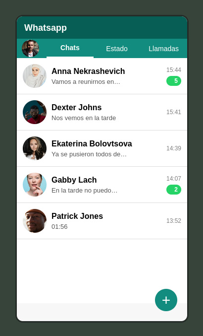

# messaging-app-structure

This exercise is about developing the basic structure of a messaging application, using WhatsApp as a reference.

## Screenshot

## Structure

- `index.html` - main page with the messaging layout
- `css/style.css` - page styles
- `img/` - images used in the chat list
- `screenshots/` - screenshots of the exercise